

 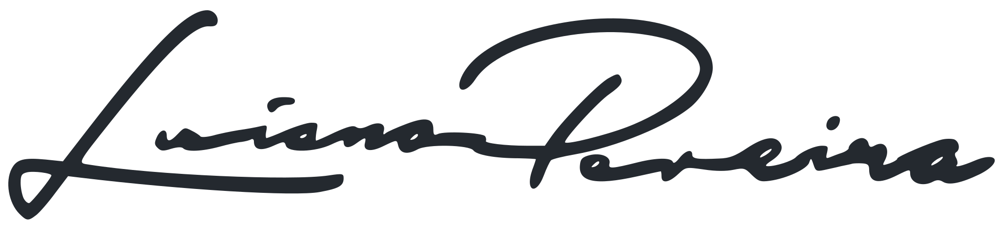 
 

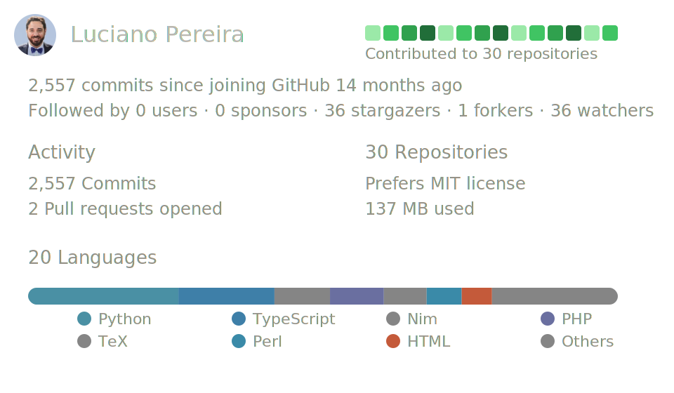

<h2 align="center">Creating clean, scalable, and maintainable solutions across the engineering lifecycle.</h2>

<h3>Currently using a diverse stack spanning applications, data, automation, and modern AI tooling:</h3>

<table>
<tr>
<td valign="middle"> PHP, Composer</td>
<td valign="middle">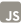 JavaScript (ES6+)</td>
</tr>
</table>

typescript

API Restful design

Laravel, Blade

Node.js

React.js

Team & Peer Programming

MySQL, ORM, Eloquent

PostgreSQL

MongoDB

Agile, Scrum, Kanban 

Python, Pandas

git, CLI, Scripting

Docker, Podman

CI/CD|GitHub Actions

HTML5, Components

CSS3, Tailwind

Vue.js, Vite

AI‑Problem Solving

<!-- 

&nbsp;

&nbsp;&nbsp;&nbsp;&nbsp;

&nbsp;&nbsp;&nbsp;&nbsp;&nbsp;

&nbsp;&nbsp;&nbsp;&nbsp;
<a rel="nofollow noopener noreferrer" target="_blank" href="https://www.gnu.org/software/bash">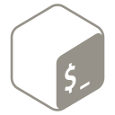</a>
&nbsp;&nbsp;&nbsp;&nbsp;
<a rel="nofollow noopener noreferrer" target="_blank" href="https://bitbucket.org">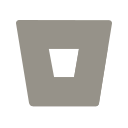</a>
&nbsp;&nbsp;&nbsp;&nbsp;

&nbsp;&nbsp;&nbsp;&nbsp;
<a rel="nofollow noopener noreferrer" target="_blank" href="https://www.open-std.org/jtc1/sc22/wg14">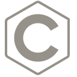</a>
&nbsp;&nbsp;&nbsp;&nbsp;
<a rel="nofollow noopener noreferrer" target="_blank" href="https://cakephp.org">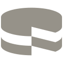</a>
&nbsp;&nbsp;&nbsp;&nbsp;
<a rel="nofollow noopener noreferrer" target="_blank" href="https://cmake.org">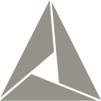</a>
&nbsp;&nbsp;&nbsp;&nbsp;

&nbsp;&nbsp;&nbsp;&nbsp;
<a rel="nofollow noopener noreferrer" target="_blank" href="https://www.w3.org/TR/2001/WD-css3-roadmap-20010523">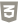</a>
&nbsp;&nbsp;&nbsp;&nbsp;

&nbsp;&nbsp;&nbsp;&nbsp;

&nbsp;&nbsp;&nbsp;&nbsp;

&nbsp;&nbsp;&nbsp;&nbsp;

&nbsp;&nbsp;&nbsp;&nbsp;

&nbsp;&nbsp;&nbsp;&nbsp;
<a rel="nofollow noopener noreferrer" target="_blank" href="https://eslint.org">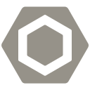</a>
&nbsp;&nbsp;&nbsp;&nbsp;

&nbsp;&nbsp;&nbsp;&nbsp;

&nbsp;&nbsp;&nbsp;&nbsp;

&nbsp;&nbsp;&nbsp;&nbsp;

&nbsp;&nbsp;&nbsp;&nbsp;

&nbsp;&nbsp;&nbsp;&nbsp;

&nbsp;&nbsp;&nbsp;&nbsp;

&nbsp;&nbsp;&nbsp;&nbsp;

&nbsp;&nbsp;&nbsp;&nbsp;
<a rel="nofollow noopener noreferrer" target="_blank" href="https://graphql.org">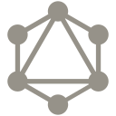</a>
&nbsp;&nbsp;&nbsp;&nbsp;

&nbsp;&nbsp;&nbsp;&nbsp;

&nbsp;&nbsp;

&nbsp;&nbsp;&nbsp;

&nbsp;&nbsp;&nbsp;&nbsp;

&nbsp;&nbsp;&nbsp;&nbsp;
<a rel="nofollow noopener noreferrer" target="_blank" href="https://developer.mozilla.org/en-US/docs/Web/JavaScript/Reference">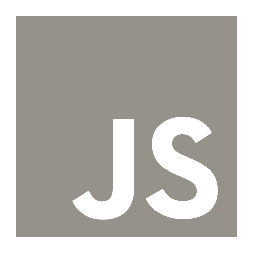</a>
&nbsp;&nbsp;&nbsp;&nbsp;

&nbsp;&nbsp;&nbsp;&nbsp;

&nbsp;&nbsp;&nbsp;&nbsp;

&nbsp;&nbsp;&nbsp;&nbsp;

&nbsp;&nbsp;&nbsp;&nbsp;

&nbsp;&nbsp;

&nbsp;&nbsp;&nbsp;&nbsp;

&nbsp;&nbsp;&nbsp;&nbsp;
<a rel="nofollow noopener noreferrer" target="_blank" href="https://www.lua.org">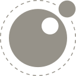</a>
&nbsp;&nbsp;&nbsp;&nbsp;

&nbsp;&nbsp;&nbsp;&nbsp;

&nbsp;&nbsp;&nbsp;&nbsp;

&nbsp;&nbsp;&nbsp;&nbsp;

&nbsp;&nbsp;&nbsp;&nbsp;

&nbsp;&nbsp;&nbsp;&nbsp;

&nbsp;&nbsp;&nbsp;&nbsp;

&nbsp;&nbsp;&nbsp;&nbsp;

&nbsp;&nbsp;&nbsp;&nbsp;

&nbsp;&nbsp;&nbsp;&nbsp;
<a rel="nofollow noopener noreferrer" target="_blank" href="https://www.npmjs.com">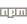</a>
&nbsp;&nbsp;&nbsp;&nbsp;
<a rel="nofollow noopener noreferrer" target="_blank" href="https://numpy.org">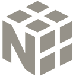</a>
&nbsp;&nbsp;&nbsp;&nbsp;
<a rel="nofollow noopener noreferrer" target="_blank" href="https://nuxtjs.org">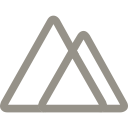</a>
&nbsp;&nbsp;&nbsp;&nbsp;

&nbsp;&nbsp;&nbsp;&nbsp;

&nbsp;&nbsp;&nbsp;&nbsp;
<a rel="nofollow noopener noreferrer" target="_blank" href="https://www.adobe.com/la/products/photoshop.html">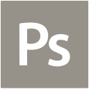</a>
&nbsp;&nbsp;&nbsp;&nbsp;

&nbsp;&nbsp;&nbsp;&nbsp;

&nbsp;&nbsp;&nbsp;&nbsp;
<a rel="nofollow noopener noreferrer" target="_blank" href="https://www.raspberrypi.com">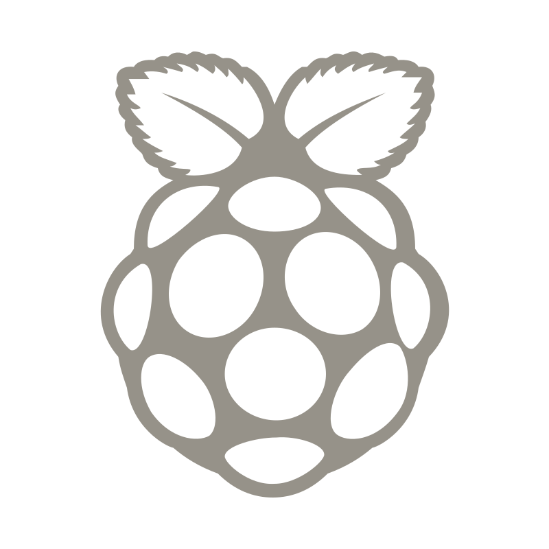</a>
&nbsp;&nbsp;&nbsp;&nbsp;

&nbsp;&nbsp;&nbsp;&nbsp;

&nbsp;&nbsp;&nbsp;&nbsp;
<a rel="nofollow noopener noreferrer" target="_blank" href="https://sequelize.org">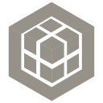</a>
&nbsp;&nbsp;&nbsp;&nbsp;
<a rel="nofollow noopener noreferrer" target="_blank" href="https://www.sketch.com">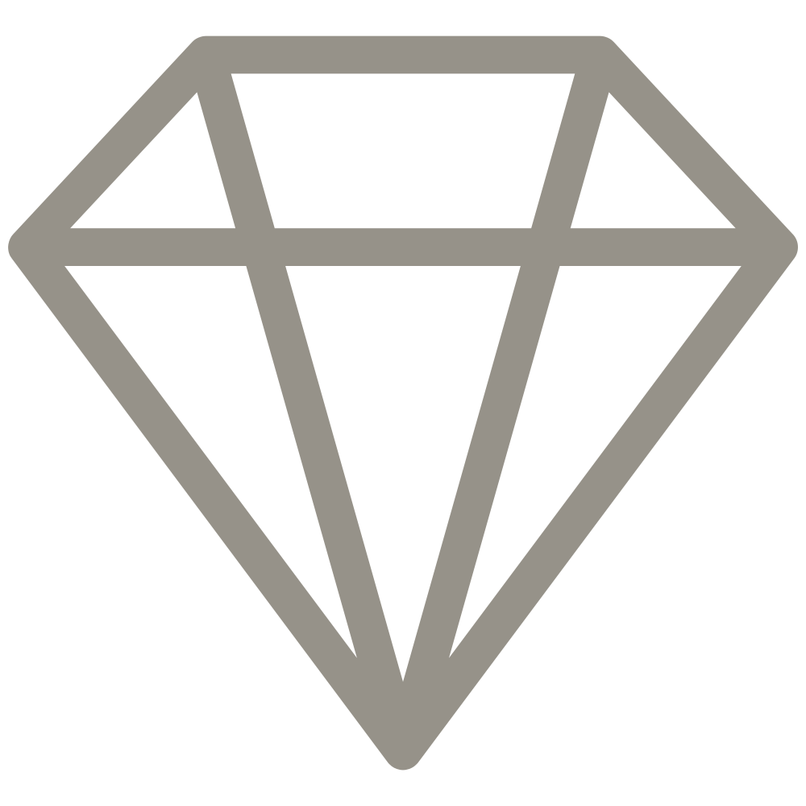</a>
&nbsp;&nbsp;&nbsp;&nbsp;

&nbsp;&nbsp;&nbsp;&nbsp;

&nbsp;&nbsp;&nbsp;&nbsp;

&nbsp;&nbsp;&nbsp;&nbsp;

&nbsp;&nbsp;&nbsp;&nbsp;

&nbsp;&nbsp;&nbsp;&nbsp;

&nbsp;&nbsp;&nbsp;&nbsp;
<a rel="nofollow noopener noreferrer" target="_blank" href="https://trello.com">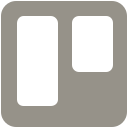</a>
&nbsp;&nbsp;&nbsp;&nbsp;

&nbsp;&nbsp;&nbsp;&nbsp;

&nbsp;&nbsp;&nbsp;&nbsp;

&nbsp;&nbsp;&nbsp;&nbsp;

&nbsp;&nbsp;&nbsp;&nbsp;

<a rel="nofollow noopener noreferrer" target="_blank" href="https://webpack.js.org">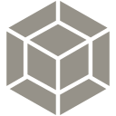</a>
&nbsp;&nbsp;&nbsp;&nbsp;

&nbsp;&nbsp;&nbsp;&nbsp;

&nbsp;&nbsp;&nbsp;&nbsp;

&nbsp;&nbsp;&nbsp;&nbsp;

-->

<table>
    <thead>
        <tr><th colspan="2">Articles</th></tr>
        <tr><th>Date</th><th>Title</th></tr>
    </thead>
    <tbody>
    <!-- BLOG-POST-LIST:START -->
<tr><td>Nov. 2025</td><td align="left"><a href="https://lucianofedericopereira.github.io/codecraft/design/unlocking-the-xterm-color-palette/">Design › Bash: Unlocking the Xterm Color Palette</a></td></tr>
<tr><td>Nov. 2025</td><td align="left"><a href="https://lucianofedericopereira.github.io/codecraft/code/automating--git-repository-backups/">Code › Bash: Automating Self-Hosting Git Repository Backups</a></td></tr>
<tr><td>Nov. 2025</td><td align="left"><a href="https://lucianofedericopereira.github.io/codecraft/code/managing-bookmarks-with-linkding-and-podman/">Code › Bash: Managing Bookmarks with Linkding and Podman</a></td></tr>
<tr><td>Oct. 2024</td><td align="left"><a href="https://lucianofedericopereira.github.io/codecraft/code/email-obfuscation/">Code › JavaScript Email Obfuscation with XOR Encoding</a></td></tr>
<tr><td>Apr. 2023</td><td align="left"><a href="https://lucianofedericopereira.github.io/codecraft/design/star-rating/">Design › CSS: Star Rating</a></td></tr>
<!-- BLOG-POST-LIST:END -->
    </tbody>
</table>

      
    
     
     
     

