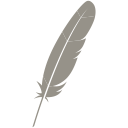
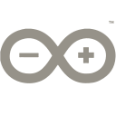

<svg xmlns="http://www.w3.org/2000/svg" style="display: none;>
  <symbol id="apple" viewBox="0 0 33.867 33.867">
    <defs><linearGradient id="a" x1="-5167.096" x2="-4570.116" y1="697.555" y2="1395.619" gradientTransform="matrix(.00334 -.00717 .00717 .00334 33.47 -36.341)" gradientUnits="userSpaceOnUse"><stop offset="0" stop-color="#969289"/><stop offset=".312" stop-color="#969289"/><stop offset=".838" stop-color="#969289"/></linearGradient><linearGradient id="b" x1="-9585.342" x2="-5326.209" y1="620.505" y2="620.505" gradientTransform="matrix(.00334 -.00717 .00717 .00334 33.47 -36.341)" gradientUnits="userSpaceOnUse"><stop offset=".323" stop-color="#969289"/><stop offset=".63" stop-color="#969289"/><stop offset=".751" stop-color="#969289"/><stop offset="1" stop-color="#969289"/></linearGradient><linearGradient id="c" x1="-9071.207" x2="-6533.178" y1="1047.69" y2="1047.69" gradientTransform="matrix(.00334 -.00717 .00717 .00334 33.47 -36.341)" gradientUnits="userSpaceOnUse"><stop offset="0" stop-color="#969289"/><stop offset=".095" stop-color="#969289"/><stop offset=".788" stop-color="#969289"/><stop offset=".949" stop-color="#969289"/></linearGradient><linearGradient id="d" x1="-9346.126" x2="-5086.994" y1="580.817" y2="580.817" gradientTransform="matrix(.00334 -.00717 .00717 .00334 33.47 -36.341)" gradientUnits="userSpaceOnUse"><stop offset=".323" stop-color="#969289"/><stop offset=".63" stop-color="#969289"/><stop offset=".751" stop-color="#969289"/><stop offset="1" stop-color="#969289"/></linearGradient><linearGradient id="e" x1="-9035.503" x2="-6797.201" y1="638.441" y2="638.441" gradientTransform="matrix(.00334 -.00717 .00717 .00334 33.47 -36.341)" gradientUnits="userSpaceOnUse"><stop offset="0" stop-color="#969289"/><stop offset=".095" stop-color="#969289"/><stop offset=".788" stop-color="#969289"/><stop offset=".949" stop-color="#969289"/></linearGradient><linearGradient id="f" x1="-9346.126" x2="-5086.994" y1="1021.622" y2="1021.622" gradientTransform="matrix(.00334 -.00717 .00717 .00334 33.47 -36.341)" gradientUnits="userSpaceOnUse"><stop offset=".323" stop-color="#969289"/><stop offset=".63" stop-color="#969289"/><stop offset=".751" stop-color="#969289"/><stop offset="1" stop-color="#969289"/></linearGradient><linearGradient id="g" x1="-9610.334" x2="-5351.202" y1="999.733" y2="999.733" gradientTransform="matrix(.00334 -.00717 .00717 .00334 33.47 -36.341)" gradientUnits="userSpaceOnUse"><stop offset=".323" stop-color="#969289"/><stop offset=".63" stop-color="#969289"/><stop offset=".751" stop-color="#969289"/><stop offset="1" stop-color="#969289"/></linearGradient><linearGradient id="h" x1="-9346.126" x2="-5086.994" y1="1152.726" y2="1152.726" gradientTransform="matrix(.00334 -.00717 .00717 .00334 33.47 -36.341)" gradientUnits="userSpaceOnUse"><stop offset=".323" stop-color="#969289"/><stop offset=".63" stop-color="#969289"/><stop offset=".751" stop-color="#969289"/><stop offset="1" stop-color="#969289"/></linearGradient><linearGradient id="i" x1="-9346.126" x2="-5086.994" y1="1137.725" y2="1137.725" gradientTransform="matrix(.00334 -.00717 .00717 .00334 33.47 -36.341)" gradientUnits="userSpaceOnUse"><stop offset=".323" stop-color="#9e2064"/><stop offset=".63" stop-color="#969289"/><stop offset=".751" stop-color="#969289"/><stop offset="1" stop-color="#969289"/></linearGradient><linearGradient id="j" x1="-6953.407" x2="-6011.999" y1="1134.716" y2="1134.716" gradientTransform="matrix(.00334 -.00717 .00717 .00334 33.47 -36.341)" gradientUnits="userSpaceOnUse"><stop offset=".323" stop-color="#969289"/><stop offset=".63" stop-color="#969289"/><stop offset=".751" stop-color="#969289"/><stop offset="1" stop-color="#969289"/></linearGradient></defs><path fill="url(#a)" d="M22.82.37c-.525.31-1.397 1.186-2.437 2.456l.956 1.804a23.57 23.57 0 0 1 2.12-2.647l-.08.087c-.223.245-.898 1.032-1.916 2.596.98-.05 2.487-.25 3.716-.46.365-2.048-.359-2.985-.359-2.985s-.92-1.49-2-.851z"/><path fill="none" d="M21.201 10.662l.021-.004-.137.015c-.009.004-.016.008-.025.01.048-.006.094-.014.141-.021zm-.976 3.231zm-6.63 7.25l.03-.081a147.122 147.122 0 0 1 1.311-3.337 123.767 123.767 0 0 1 1.423-3.347 104.695 104.695 0 0 1 1.44-3.104l.108-.22c.005-.013.012-.024.017-.036l-.117.012-.093-.183-.028.054a74.825 74.825 0 0 0-.782 1.6 96.43 96.43 0 0 0-1.522 3.353 129.991 129.991 0 0 0-1.386 3.326c-.23.574-.455 1.142-.671 1.704a174.62 174.62 0 0 0-.655 1.722l.147.29.13-.014a161.752 161.752 0 0 1 .646-1.74zm6.33-7.198h0z"/><path fill="#969289" d="M19.609 15.52c-.122.023-.248.044-.377.067h-.002a6.991 6.991 0 0 0 .379-.066z"/><path fill="#969289" d="M19.609 15.52c-.122.023-.248.044-.377.067h-.002a6.991 6.991 0 0 0 .379-.066z" opacity=".35"/><path fill="#969289" d="M19.929 13.944h-.001l-.002.001.06-.008c.082-.012.162-.026.24-.043l-.297.05z"/><path fill="#969289" d="M19.929 13.944h-.001l-.002.001.06-.008c.082-.012.162-.026.24-.043l-.297.05z" opacity=".35"/><path fill="url(#b)" d="M18.52 9.292c.291-.543.586-1.074.883-1.59.309-.537.621-1.058.937-1.56l.056-.089c.311-.494.626-.968.944-1.423l-.956-1.804-.218.268c-.275.344-.562.713-.855 1.105a53.287 53.287 0 0 0-1.983 2.84 59.17 59.17 0 0 0-.827 1.3l-.031.05 1.244 2.458c.266-.526.535-1.046.807-1.555z"/><path fill="url(#c)" d="M12.855 23.136c-.164.452-.33.913-.496 1.384l-.007.02-.07.2c-.112.317-.21.602-.432 1.252.367.167.661.607.94 1.106a2.006 2.006 0 0 0-.65-1.378c1.806.081 3.363-.375 4.168-1.696.072-.118.137-.241.197-.373-.366.463-.82.66-1.673.612l-.006.003.006-.003c1.257-.562 1.887-1.102 2.444-1.997.132-.212.26-.444.392-.701-1.1 1.128-2.372 1.45-3.714 1.206l-1.005.11-.094.255z"/><path fill="url(#d)" d="M13.325 20.883a135.914 135.914 0 0 1 2.057-5.03 99.293 99.293 0 0 1 1.806-3.945c.164-.339.33-.675.498-1.008l.028-.054-1.244-2.457-.061.1a58.133 58.133 0 0 0-1.704 2.976 51.634 51.634 0 0 0-.81 1.586 36.326 36.326 0 0 0-.737 1.615 32.615 32.615 0 0 0-1.013 2.692c-.087.276-.17.554-.249.83-.186.652-.346 1.301-.477 1.949l1.25 2.468a174.62 174.62 0 0 1 .656-1.722z"/><path fill="url(#e)" d="M11.402 20.224c-.156.79-.268 1.577-.324 2.358-.002.028-.005.055-.006.083-.39-.625-1.435-1.235-1.432-1.23.747 1.084 1.315 2.16 1.4 3.217-.401.082-.95-.037-1.583-.27.66.607 1.157.775 1.35.82-.607.038-1.24.455-1.876.935.93-.38 1.683-.53 2.222-.408a183.431 183.431 0 0 0-2.568 7.927c.262-.078.42-.254.507-.493.153-.514 1.166-3.883 2.754-8.312l.137-.38.04-.106a166.035 166.035 0 0 1 .646-1.759l-1.248-2.467c-.006.028-.013.056-.018.085z"/><path fill="url(#f)" d="M17.907 11.054l-.108.22-.327.681c-.12.251-.24.508-.362.77l-.185.4a104.68 104.68 0 0 0-1.284 2.907 123.767 123.767 0 0 0-1.391 3.409 147.13 147.13 0 0 0-1.301 3.44l1.005-.11-.06-.01c1.203-.15 2.801-1.048 3.835-2.158a9.537 9.537 0 0 0 1.308-1.82c.297-.525.577-1.107.843-1.752.232-.564.455-1.174.67-1.835a3.646 3.646 0 0 1-.941.327 6.019 6.019 0 0 1-.38.066h.003c1.122-.432 1.829-1.265 2.343-2.285a3.994 3.994 0 0 1-1.349.59c-.078.018-.158.032-.239.044l-.06.008h.002v-.001c.39-.163.718-.345 1.003-.56a3.52 3.52 0 0 0 .573-.545 3.906 3.906 0 0 0 .403-.578l.107-.212c.157-.315.282-.596.382-.843a7.959 7.959 0 0 0 .27-.783c.038-.138.061-.248.074-.328-.038.03-.082.06-.13.09-.34.202-.92.385-1.389.472l.924-.102-.924.102-.02.004-.143.023.025-.011-3.16.346a1.284 1.284 0 0 1-.017.034z"/><path fill="url(#g)" d="M21.464 4.667c-.281.431-.588.92-.918 1.476-.018.028-.035.058-.052.087a66.638 66.638 0 0 0-1.765 3.194c-.26.5-.529 1.033-.804 1.595l3.16-.346c.92-.424 1.331-.807 1.731-1.36.106-.153.213-.313.319-.478.324-.507.642-1.065.927-1.62a16.81 16.81 0 0 0 .703-1.545c.118-.305.213-.588.279-.836.057-.22.102-.428.137-.626-1.23.21-2.737.41-3.717.459z"/><path fill="#969289" d="M19.422 15.557z"/><path fill="#969289" d="M19.422 15.557z" opacity=".35"/><path fill="url(#h)" d="M19.422 15.557z"/><path fill="#969289" d="M19.925 13.945l.06-.008-.06.008z"/><path fill="#969289" d="M19.925 13.945l.06-.008-.06.008z" opacity=".35"/><path fill="url(#i)" d="M19.925 13.945l.06-.008-.06.008z"/><path fill="#969289" d="M19.928 13.945v-.001z"/><path fill="#969289" d="M19.928 13.945v-.001z" opacity=".35"/><path fill="url(#j)" d="M19.928 13.945v-.001z"/>
  </symbol>
  <symbol id="apple" viewBox="0 0 33.867 33.867">
    <path fill="#969289" d="M29.655 11.623c-.193.15-3.612 2.077-3.612 6.36 0 4.955 4.35 6.708 4.48 6.751-.02.107-.69 2.4-2.293 4.738-1.43 2.056-2.922 4.11-5.192 4.11s-2.854-1.32-5.475-1.32c-2.554 0-3.463 1.363-5.54 1.363-2.076 0-3.525-1.903-5.19-4.24-1.93-2.744-3.49-7.008-3.49-11.054 0-6.49 4.22-9.933 8.374-9.933 2.207 0 4.046 1.449 5.432 1.449 1.318 0 3.375-1.536 5.886-1.536.951 0 4.37.087 6.62 3.312zm-7.812-6.06c1.038-1.232 1.773-2.94 1.773-4.65 0-.237-.02-.478-.064-.671-1.69.063-3.699 1.125-4.91 2.53-.952 1.082-1.84 2.791-1.84 4.524 0 .26.043.521.063.605.107.02.28.043.454.043 1.516 0 3.422-1.015 4.524-2.38z"/>
  </symbol>
  <symbol id="arduino" viewBox="0 0 33.867 33.867">
    <path fill="#969289" fill-rule="evenodd" d="M.3 66.5v-9.6c.2-.1.2-.3.2-.5 3-13.1 11.2-21 24.2-24.1 1.1-.3 2.3-.2 3.4-.6h6.4c.1.2.4.1.6.1 6.4.7 12.2 3 17.3 7 4.4 3.3 7.8 7.5 10.9 12 .4.6.6.6 1 0 1.8-2.6 3.7-5.1 5.9-7.4 5.3-5.7 11.7-9.7 19.5-11.1 1.1-.3 2.4-.2 3.5-.6h6.2c.1.2.3.1.5.1 1.9.2 3.7.6 5.5 1.1 13.4 3.9 22.9 16.2 22.1 30.1-.6 11.7-6.5 20.1-16.8 25.4-5.1 2.8-10.7 3.5-16.5 3.4-7.6-.1-14.2-2.7-19.9-7.7-4-3.5-7.1-7.7-10-12.1-.4-.6-.6-.5-1 .1-1.8 2.7-3.7 5.4-5.9 8-3.9 4.4-8.4 8-14 9.9-6.9 2.4-13.9 2.5-20.9.6-10.1-2.9-17-9.3-20.8-19.1-.6-1.6-.9-3.4-1.4-5zm31.8 14.7c5.7.2 10.6-1.7 14.8-5.6 4.3-4 7.4-9 10.5-13.9.1-.3.1-.5-.1-.8-2.6-4.1-5.3-8.2-8.9-11.6-6.9-6.6-15-8.8-24.1-5.9-7.5 2.5-12.3 7.8-13.4 15.8-1.1 7.5 1.8 13.5 7.8 18 4 2.9 8.5 4.1 13.4 4zm63.4 0c2.2 0 4.4-.1 6.5-.7 7.9-2.4 13.1-7.3 14.6-15.5 1.5-8.1-1.6-14.6-8.4-19.2-7.5-5.2-18.4-4.7-26 1-5.1 3.8-8.5 8.9-11.9 14.2-.2.3-.1.5 0 .8 2.7 4.3 5.4 8.6 8.9 12.3 4.4 4.7 9.7 7.4 16.3 7.1zm0 0"/><path d="M32 58.5c3.2 0 6.5.1 9.7 0 .8 0 .9.2.9 1-.1.9-.1 1.8 0 2.7.1.8-.1 1-1 1H28.8c-2.2 0-4.4-.1-6.6 0-.7 0-.9-.2-.9-1 .1-.9.1-1.8 0-2.8 0-.7.2-.9.9-.9 3.2.1 6.5 0 9.8 0zm63-6.4c.8 0 1.6.1 2.3 0 .5 0 .7.2.7.7-.1 1.4 0 2.8-.1 4.2 0 .7.2.9.9.9 1.3-.1 2.7 0 4.1-.1.6 0 .8.1.8.8v4.6c0 .5-.2.7-.7.7-1.4-.1-2.8 0-4.3-.1-.6 0-.8.2-.8.8.1 1.4 0 2.8.1 4.2 0 .6-.2.9-.8.9-1.5-.1-3-.1-4.5 0-.6 0-.8-.2-.8-.8.1-1.5 0-2.9.1-4.4 0-.5-.2-.7-.7-.7-1.4.1-2.8 0-4.2.1-.8 0-.9-.3-.9-.9 0-1.4.1-2.8 0-4.2-.1-.8.3-1 1-1 1.4.1 2.7 0 4.1.1.5 0 .7-.2.7-.7-.1-1.4 0-2.9-.1-4.3 0-.6.2-.8.8-.8.8.1 1.5 0 2.3 0zm29.852-27.623c-.133.199-.18.265-.223.332-.242.363-.055 1.097-.664 1.086-.54-.012-.403-.684-.594-1.051-.05-.098-.11-.188-.277-.461 0 .504.008.789 0 1.078-.008.195.035.441-.274.457-.312.016-.293-.234-.297-.43-.007-.68-.007-1.355-.003-2.031 0-.23-.036-.496.324-.504.27-.004.504-.015.617.336.144.43.195.91.527 1.324.317-.402.371-.867.492-1.293.102-.347.317-.37.598-.37.356.003.34.253.344.488.004.68.004 1.355-.004 2.035-.004.191.023.445-.281.449-.305 0-.282-.242-.285-.442-.008-.289 0-.574 0-1.003zm-3.712-1.532c.087 0 .18-.015.262 0 .325.063.828-.187.934.2.144.543-.426.27-.668.386-.242.117-.195.332-.2.528-.011.468-.007.937-.007 1.406 0 .258-.05.473-.383.46-.305-.01-.293-.234-.293-.437a36.975 36.975 0 0 1-.004-1.316c.012-.375.016-.727-.523-.676-.188.016-.352-.039-.352-.277 0-.328.254-.262.442-.27.265-.012.527-.004.793-.004zm0 0"/>
  </symbol>
</svg>

  
 

&nbsp;
<a rel="nofollow" target="_blank" rel="noopener" rel="noreferrer" href="https://apache.org">
<!--
    
-->
    <svg height="24px" alt="apache"> <use href="#apache"></use></svg>
</a>
&nbsp;&nbsp;&nbsp;&nbsp;

&nbsp;&nbsp;&nbsp;&nbsp;&nbsp;

&nbsp;&nbsp;&nbsp;&nbsp;

&nbsp;&nbsp;&nbsp;&nbsp;

&nbsp;&nbsp;&nbsp;&nbsp;

&nbsp;&nbsp;&nbsp;&nbsp;

&nbsp;&nbsp;&nbsp;&nbsp;

&nbsp;&nbsp;&nbsp;&nbsp;

&nbsp;&nbsp;&nbsp;&nbsp;

&nbsp;&nbsp;&nbsp;&nbsp;

&nbsp;&nbsp;&nbsp;&nbsp;

&nbsp;&nbsp;&nbsp;&nbsp;

&nbsp;&nbsp;&nbsp;&nbsp;

&nbsp;&nbsp;&nbsp;&nbsp;

&nbsp;&nbsp;&nbsp;&nbsp;

&nbsp;&nbsp;&nbsp;&nbsp;

&nbsp;&nbsp;&nbsp;&nbsp;

&nbsp;&nbsp;&nbsp;&nbsp;

&nbsp;&nbsp;&nbsp;&nbsp;

&nbsp;&nbsp;&nbsp;&nbsp;

&nbsp;&nbsp;&nbsp;&nbsp;

&nbsp;&nbsp;&nbsp;&nbsp;

&nbsp;&nbsp;&nbsp;&nbsp;

&nbsp;&nbsp;&nbsp;&nbsp;

&nbsp;&nbsp;&nbsp;&nbsp;

&nbsp;&nbsp;&nbsp;&nbsp;

&nbsp;&nbsp;&nbsp;&nbsp;

&nbsp;&nbsp;

&nbsp;&nbsp;&nbsp;

&nbsp;&nbsp;&nbsp;&nbsp;

&nbsp;&nbsp;&nbsp;&nbsp;

&nbsp;&nbsp;&nbsp;&nbsp;

&nbsp;&nbsp;&nbsp;&nbsp;

&nbsp;&nbsp;&nbsp;&nbsp;

&nbsp;&nbsp;&nbsp;&nbsp;

&nbsp;&nbsp;&nbsp;&nbsp;

&nbsp;&nbsp;

&nbsp;&nbsp;&nbsp;&nbsp;

&nbsp;&nbsp;&nbsp;&nbsp;

&nbsp;&nbsp;&nbsp;&nbsp;

&nbsp;&nbsp;&nbsp;&nbsp;

&nbsp;&nbsp;&nbsp;&nbsp;

&nbsp;&nbsp;&nbsp;&nbsp;

&nbsp;&nbsp;&nbsp;&nbsp;

&nbsp;&nbsp;&nbsp;&nbsp;

&nbsp;&nbsp;&nbsp;&nbsp;

&nbsp;&nbsp;&nbsp;&nbsp;

&nbsp;&nbsp;&nbsp;&nbsp;

&nbsp;&nbsp;&nbsp;&nbsp;

&nbsp;&nbsp;&nbsp;&nbsp;

&nbsp;&nbsp;&nbsp;&nbsp;

&nbsp;&nbsp;&nbsp;&nbsp;

&nbsp;&nbsp;&nbsp;&nbsp;

&nbsp;&nbsp;&nbsp;&nbsp;

&nbsp;&nbsp;&nbsp;&nbsp;

&nbsp;&nbsp;&nbsp;&nbsp;

&nbsp;&nbsp;&nbsp;&nbsp;

&nbsp;&nbsp;&nbsp;&nbsp;

&nbsp;&nbsp;&nbsp;&nbsp;

&nbsp;&nbsp;&nbsp;&nbsp;

&nbsp;&nbsp;&nbsp;&nbsp;

&nbsp;&nbsp;&nbsp;&nbsp;

&nbsp;&nbsp;&nbsp;&nbsp;

&nbsp;&nbsp;&nbsp;&nbsp;

&nbsp;&nbsp;&nbsp;&nbsp;

&nbsp;&nbsp;&nbsp;&nbsp;

&nbsp;&nbsp;&nbsp;&nbsp;

&nbsp;&nbsp;&nbsp;&nbsp;

&nbsp;&nbsp;&nbsp;&nbsp;

&nbsp;&nbsp;&nbsp;&nbsp;

&nbsp;&nbsp;&nbsp;&nbsp;

&nbsp;&nbsp;&nbsp;&nbsp;

&nbsp;&nbsp;&nbsp;&nbsp;

&nbsp;&nbsp;&nbsp;&nbsp;

&nbsp;&nbsp;&nbsp;&nbsp;

&nbsp;&nbsp;&nbsp;&nbsp;

&nbsp;&nbsp;&nbsp;&nbsp;

<table>
    <thead>
        <tr><th colspan="2">Articles</th></tr>
        <tr><th>Date</th><th>Title</th></tr>
    </thead>
    <tbody>
    <!-- BLOG-POST-LIST:START -->
<tr><td> Apr. 2023</td><td align="left"><a href='https://lucianofedericopereira.github.io/articles/code/email-obfuscation/'>Code › Js: Email Obsfrustration</a></td></tr>
<tr><td> Apr. 2023</td><td align="left"><a href='https://lucianofedericopereira.github.io/articles/design/star-rating/'>Design › CSS: Star Rating</a></td></tr><!-- BLOG-POST-LIST:END -->
    </tbody>
</table>

     
    
     
     
     

