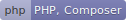

    <picture>
         
    </picture>
     
    <picture>
        
    </picture>

<h2 align="center">
    Creating clean, scalable, and maintainable solutions
     
    across the full development lifecycle.
</h2>

    <picture>
        
    </picture>

<h3 align="center">Currently using a diverse stack spanning applications,  data, automation, and modern AI tooling:</h3>
 

    <!-- Row 1: API + Docker + PostgreSQL (142 + 124 + 97 = 363px) -->
    <picture>
        
    </picture>
    <picture>
        
    </picture>
    <picture>
        
    </picture>
    <!-- Row 2: AI + MongoDB + Laravel (198 + 85 + 73 = 356px + spacing ≈ 363px) -->
      
    <picture>
        
    </picture>
    &thinsp;
    <picture>
        
    </picture>
    &thinsp;    
    <picture>
        
    </picture>
    <!-- Row 3: PHP + GitHub + Python (126 + 119 + 118 = 363px) -->
      
    <picture>
        
    </picture>
    &thinsp;
    <picture>
        
    </picture>
    &thinsp;
    <picture>
        
    </picture>
    <!-- Row 4: MySQL + Git + TypeScript (148 + 127 + 87 = 362px + spacing ≈ 363px) -->
      
    <picture>
        
    </picture>
    &thinsp;
    <picture>
        
    </picture>
    &thinsp;
    <picture>
        
    </picture>
    <!-- Row 5: Team + Vue + Node (179 + 97 + 75 = 351px + spacing ≈ 363px) -->
      
    <picture>
        
    </picture>
    &nbsp;&nbsp;
    <picture>
        
    </picture>
    &nbsp;&nbsp;
    <picture>
        
    </picture>
    <!-- Row 6: Agile + HTML + React (152 + 140 + 64 = 356px + spacing ≈ 363px) -->
      
    <picture>
        
    </picture>
    &nbsp;&thinsp;
    <picture>
        
    </picture>
    &nbsp;&thinsp;
    <picture>
        
    </picture>        
    <!-- Row 7: Tailwind (116px) -->
      
    <picture>
        
    </picture>

 

<h3 align="center">Recent Writing</h3>

<table width="90%">
    <thead width="90%">
        <tr><th colspan="2">Articles</th></tr>
        <tr><th>Date</th><th>Title</th></tr>
    </thead>
    <tbody>
    <!-- BLOG-POST-LIST:START -->
<tr><td>Nov. 2025</td><td align="left"><a href="https://lucianofedericopereira.github.io/codecraft/design/unlocking-the-xterm-color-palette/">Design › Bash: Unlocking the Xterm Color Palette</a></td></tr>
<tr><td>Nov. 2025</td><td align="left"><a href="https://lucianofedericopereira.github.io/codecraft/code/automating--git-repository-backups/">Code › Bash: Automating Self-Hosting Git Repository Backups</a></td></tr>
<tr><td>Nov. 2025</td><td align="left"><a href="https://lucianofedericopereira.github.io/codecraft/code/managing-bookmarks-with-linkding-and-podman/">Code › Bash: Managing Bookmarks with Linkding and Podman</a></td></tr>
<tr><td>Oct. 2024</td><td align="left"><a href="https://lucianofedericopereira.github.io/codecraft/code/email-obfuscation/">Code › JavaScript Email Obfuscation with XOR Encoding</a></td></tr>
<tr><td>Apr. 2023</td><td align="left"><a href="https://lucianofedericopereira.github.io/codecraft/design/star-rating/">Design › CSS: Star Rating</a></td></tr>
<!-- BLOG-POST-LIST:END -->
    </tbody>
</table>

     
    <picture>
    
    </picture>
     
    
     
    
     
    
     
    

