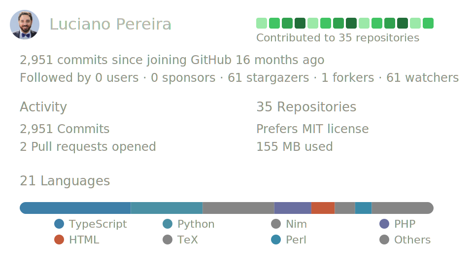
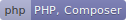

    <picture>
         
    </picture>
     
    <picture>
        
    </picture>

<h2 align="center">
    Creating clean, scalable, and maintainable solutions
     
    across the full development lifecycle.
</h2>

    <picture>
        
    </picture>

<h3 align="center">Current stack of technical and interpersonal competencies:</h3>
 

    <picture>
        
    </picture>
    <picture>
        
    </picture>
    <picture>
        
    </picture>
    <picture>
        
    </picture>
    <picture>
        
    </picture>
    <picture>
        
    </picture>
    <picture>
        
    </picture>
    <picture>
        
    </picture>
    <picture>
        
    </picture>
    <picture>
        
    </picture>
    <picture>
        
    </picture>
    <picture>
        
    </picture>
    <picture>
        
    </picture>
    <picture>
        
    </picture>
    <picture>
        
    </picture>
    <picture>
        
    </picture>
    <picture>
        
    </picture>
    <picture>
        
    </picture>        
    <picture>
        
    </picture>
    <picture>
        
    </picture>

 

<h3 align="center">Recent Writing</h3>

<table width="90%">
    <thead width="90%">
        <tr><th colspan="2">Articles</th></tr>
        <tr><th>Date</th><th>Title</th></tr>
    </thead>
    <tbody>
    <!-- BLOG-POST-LIST:START -->
<tr><td>May. 2026</td><td align="left"><a href="https://lucianofedericopereira.github.io/codecraft/design/oh-my-gruvbox/">Design › Oh My GruvBox: Bringing Retro Colors to Oh My Posh</a></td></tr>
<tr><td>May. 2026</td><td align="left"><a href="https://lucianofedericopereira.github.io/codecraft/code/autocommit-teaching-github-actions/">Code › AutoCommit: The Green Grid as a Learning Device</a></td></tr>
<tr><td>May. 2026</td><td align="left"><a href="https://lucianofedericopereira.github.io/codecraft/code/linknim-bookmark-server/">Code › Linknim: A Bookmark Server Written in Nim</a></td></tr>
<tr><td>May. 2026</td><td align="left"><a href="https://lucianofedericopereira.github.io/codecraft/code/vapor-chamber-vue-command-bus/">Code › Vapor Chamber: A Command Bus for Vue Vapor</a></td></tr>
<tr><td>May. 2026</td><td align="left"><a href="https://lucianofedericopereira.github.io/codecraft/code/groove-nim-version-control/">Code › Groove: Save States for Solo Development</a></td></tr>
<tr><td>Apr. 2026</td><td align="left"><a href="https://lucianofedericopereira.github.io/codecraft/code/nemo-sushi-preview/">Code › Nemo Sushi Preview: Quick Look for Linux</a></td></tr>
<tr><td>Apr. 2026</td><td align="left"><a href="https://lucianofedericopereira.github.io/codecraft/code/nimbase-terminal-database/">Code › NimBase: xBase Programming for the Modern Linux Terminal</a></td></tr>
<tr><td>Apr. 2026</td><td align="left"><a href="https://lucianofedericopereira.github.io/codecraft/code/mysqlite-sqlite-mysql-protocol/">Code › MySQLite: MySQL Protocol Over SQLite</a></td></tr>
<tr><td>Apr. 2026</td><td align="left"><a href="https://lucianofedericopereira.github.io/codecraft/code/waybar-weather-widget/">Code › Waybar Weather Widget: Live Weather in Your Status Bar</a></td></tr>
<tr><td>Mar. 2026</td><td align="left"><a href="https://lucianofedericopereira.github.io/codecraft/code/rest-api-blueprints/">Code › REST API Blueprints: Seven Production-Grade Implementations</a></td></tr>
<!-- BLOG-POST-LIST:END -->
    </tbody>
</table>

     
    <picture>
    
    </picture>
     
    
     
    
     
    
     
    

