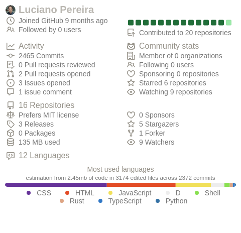

  
 

<h2 align="center">Creating clean, scalable, and maintainable solutions across the full development lifecycle.</h2>

<h3>Currently using a diverse stack spanning applications, data, automation, and modern AI tooling:</h3>

&nbsp;
&nbsp;
&nbsp;
&nbsp;
&nbsp;
&nbsp;
&nbsp;
&nbsp;
&nbsp;
&nbsp;
&nbsp;
&nbsp;
&nbsp;
&nbsp;
&nbsp;
&nbsp;
&nbsp;
&nbsp;

<table>
    <thead>
        <tr><th colspan="2">Articles</th></tr>
        <tr><th>Date</th><th>Title</th></tr>
    </thead>
    <tbody>
    <!-- BLOG-POST-LIST:START -->
<tr><td>Nov. 2025</td><td align="left"><a href="https://lucianofedericopereira.github.io/codecraft/design/unlocking-the-xterm-color-palette/">Design › Bash: Unlocking the Xterm Color Palette</a></td></tr>
<tr><td>Nov. 2025</td><td align="left"><a href="https://lucianofedericopereira.github.io/codecraft/code/automating--git-repository-backups/">Code › Bash: Automating Self-Hosting Git Repository Backups</a></td></tr>
<tr><td>Nov. 2025</td><td align="left"><a href="https://lucianofedericopereira.github.io/codecraft/code/managing-bookmarks-with-linkding-and-podman/">Code › Bash: Managing Bookmarks with Linkding and Podman</a></td></tr>
<tr><td>Oct. 2024</td><td align="left"><a href="https://lucianofedericopereira.github.io/codecraft/code/email-obfuscation/">Code › JavaScript Email Obfuscation with XOR Encoding</a></td></tr>
<tr><td>Apr. 2023</td><td align="left"><a href="https://lucianofedericopereira.github.io/codecraft/design/star-rating/">Design › CSS: Star Rating</a></td></tr>
<!-- BLOG-POST-LIST:END -->
    </tbody>
</table>

      
    
     
     
     

